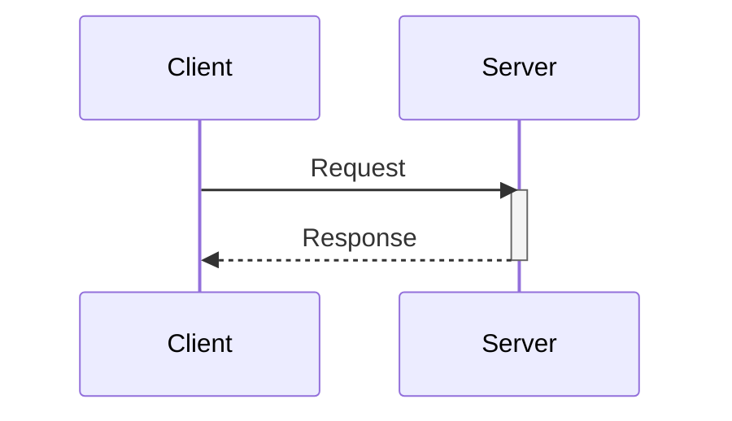
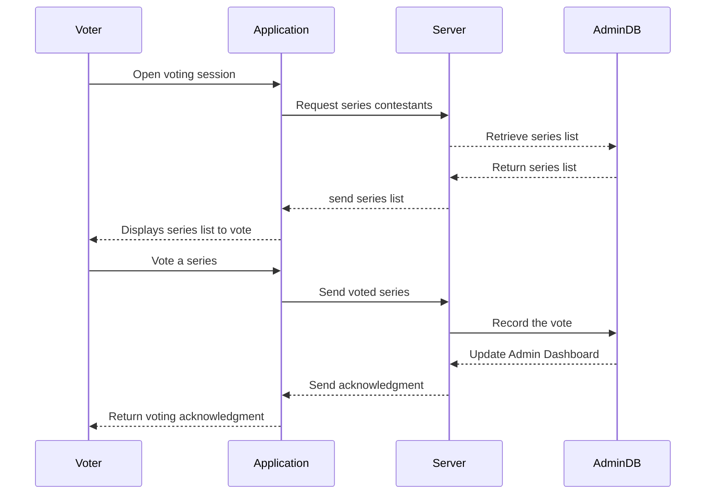
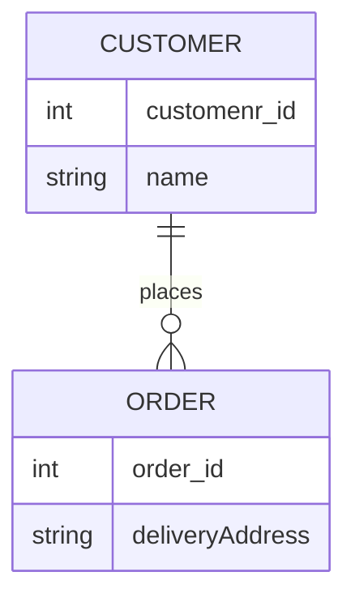
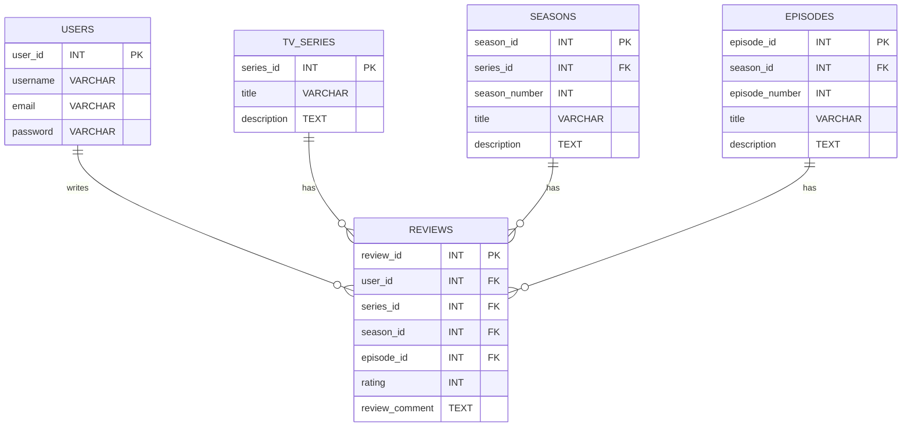

# Homework 1

Please answer the following questions in this document, under each question, and submit your work on Gradescope by, Tue, Feb 6, at 11:00 PM ET.

## Personal Information

* Your full name as it appears on Gradescope: Sana Muthaharunnisa Shaik
* The link to this reposiotry: 

## Scenario

There is a contest where you can vote for your favorite TV series. The contest features ten popular TV series, including Friends, Game of Thrones, The Big Bang Theory, Breaking Bad, and others. The contest will last for a few hours.

We need to develop an application to support this voting contest. The voting application should cater to a regional audience across the entire U.S. and be accessible on both mobile and desktop platforms. We want to prevent users from voting multiple times, but we also want to avoid the complexities and frictions of traditional user registration and authentication.

Administrators of the voting application should have access to the current vote count. Due to the short voting period, we anticipate a high frequency of votes, potentially reaching tens of thousands per second.

## Question 1

Identify at least two user roles for the app based on the provided scenario. Write a functional requirement from the perspective of each in the format of a user story. The requirements must be based on the provided scenario.

User Roles:
Administrator : Monitors the live count of vote.
Voter : votes the favourite series in the contest.

User Stories:
As an Administrator, I want to get the live count, so that I can monitor the voting count.
As an Voter, I want to vote the my favourite series from the given series, so that my favourite series wins

## Question 2

Write three non-functional requirements based on the scenario provided. You should write two system quality attributes (choose from: availability, performance, scalability, and reliability) and one system constraint (choose from: technical, business, legal). Label each requirement accordingly, e.g., #scalability or #legal.

System Quality Attributes:

1.Availability : As voting is only for limited period, user load will be peak, load balancing needs to prioritised, so that availability of application is continuous.

2.Performance : The application should be able to handle high frequency of votes, so that there is seamless experience to user with no buffering.

System Constraints:
Technical: The application must be compatible to support wide range of Operation system and devices across various mobile and desktop platforms.

## Question 3

Write two clarifying questions you would ask an interviewer if they had asked you to design the software described above. One question should clarify a functional requirement, and the other should clarify a non-functional requirement. Label them to indicate which is which. For each question, further explain why you are asking it, i.e., how it affects your design.

Functional Requirement:
Question : When a voter votes the desired series, Are we planning to display the statistical  information of votes to the voter, like any graphical representation of vote percentage?

Reasoning: This is to clarify the information to be displayed on screen,and it signifies the need of instant response from the server upon voting.

Non-Functional Requirement:
Question: when there is a lot of trafic, and user load is peak, how is application handle?

Reason: This is to handle down time of application, scalability feature of non-functional requirement also helping the system availability during the peak load.

## Question 4

Draw a sequence diagram illustrating the process of a user voting for a TV series, the system recording the vote, and the real-time update being sent to the admin dashboard. If you need more information about the system requirements, make assumptions.

> You can use [Mermaid.js syntax to draw sequence diagrams](https://mermaid.js.org/syntax/sequenceDiagram.html). GitHub renders the diagram!

Here is an example: 

## Question 5

If the TV series voting application expanded its features allowing users to register, create profiles, and review TV series, seasons, or episodes, how would the relational data model look? Draw an Entity Relationship Diagram (ERD) considering entities like Users, TV Series, Seasons, Episodes, and Reviews. Ensure your model is in third normal form (3NF).

> You can use [Mermaid.js syntax to ERDs](https://mermaid.js.org/syntax/entityRelationshipDiagram.html). GitHub renders the diagram!

Here is an example: 

